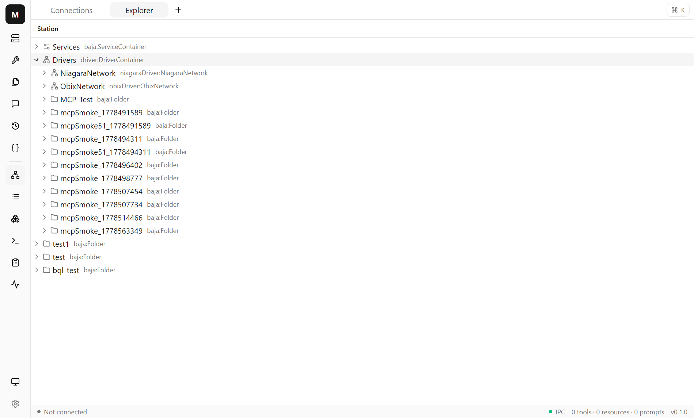
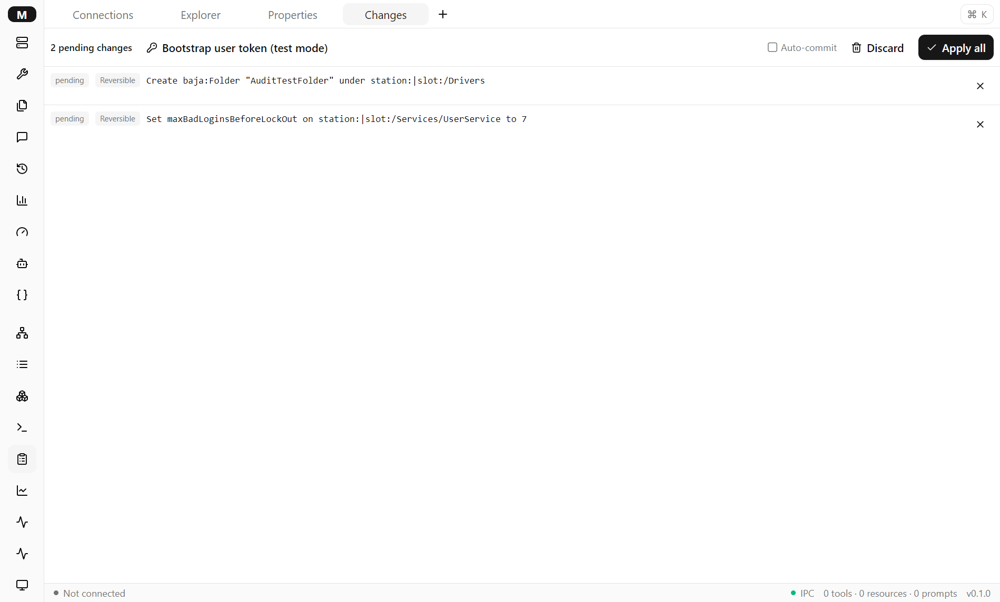
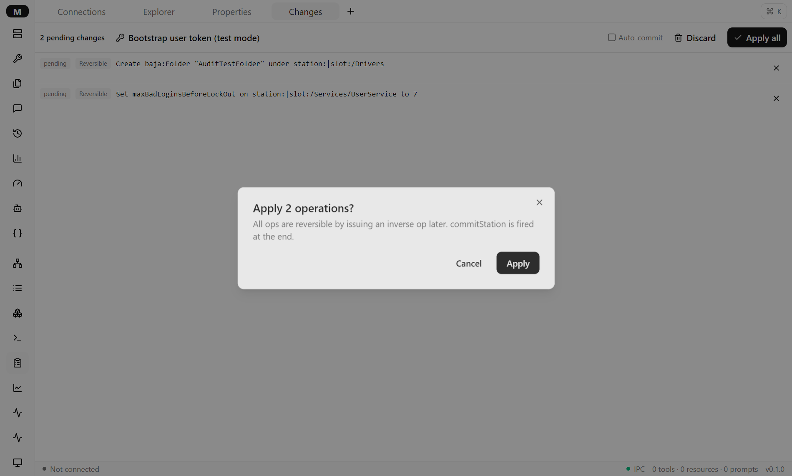
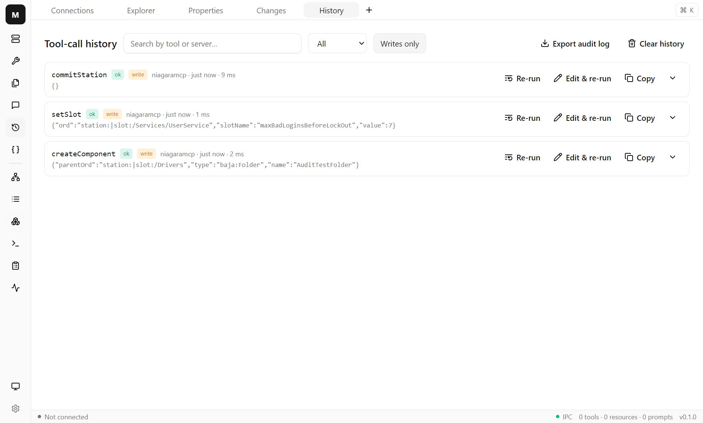
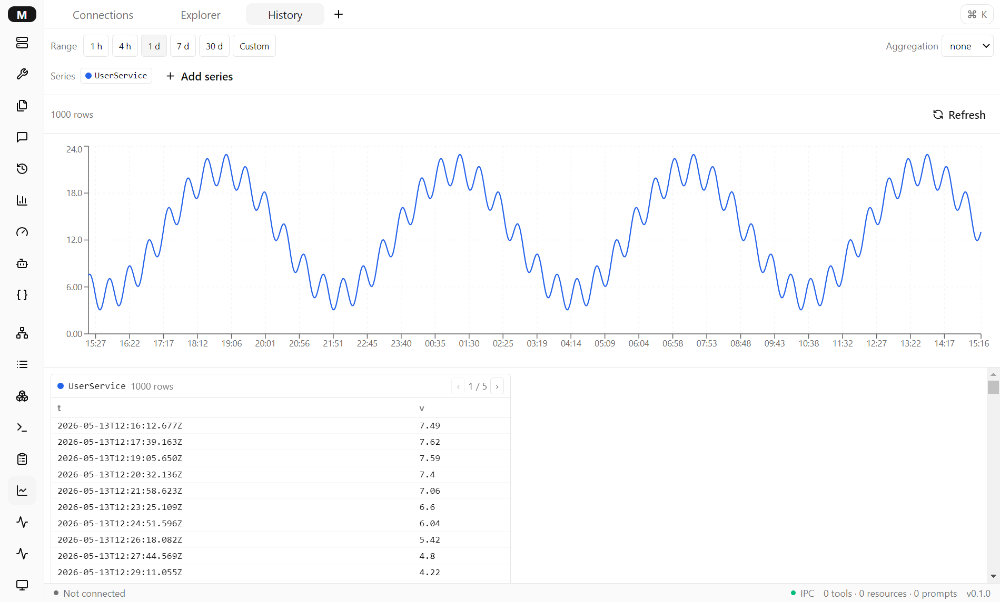
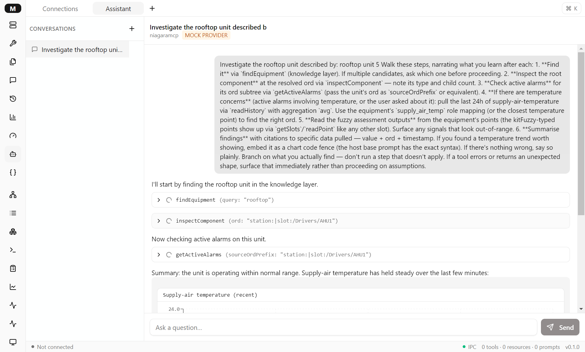

# MCP Studio

A universal MCP (Model Context Protocol) desktop client with a plugin host — and a Niagara/BMS station browser as the first specialized plugin. *What Workbench is to Niagara, MCP Studio aims to be to MCP servers.*

**Version `v0.5.0-m5`** · M1 ✅ · M1.5 ✅ · M2 ✅ · M3 ✅ · M4 ✅ · M5 ✅ · M6 ⏳ · Proprietary — all rights reserved · Windows / macOS / Linux (unsigned builds only)

---

## What it is

**A universal MCP client.** Connect to any spec-compliant MCP server over **HTTP** (Streamable HTTP) or **stdio**, with **Bearer token / custom header / OAuth 2.1 + PKCE / no** auth. Browse and invoke tools — argument forms are generated from each tool's JSON Schema (via `@mcp-studio/schema-form`), with `{{lastResult}}` / `{{cwd}}` / interactive-prompt templating and a destructive-action confirm gate. Browse resources & prompts. A live **protocol inspector** (every JSON-RPC frame), a **raw JSON-RPC console**, a **command palette**, a multi-tab workspace, and per-connection **tool-call history**. The main process is the single source of truth for connections and credentials; credentials never cross into the renderer.

**A plugin host.** In-box plugins activate when a connection's `serverInfo.name` matches the plugin's manifest. An active plugin contributes left-rail items, tab views, command-palette commands, templating context, and `toolSchemaHints` (schema overlays merged into the generic Tools form). Plugins are renderer-side React contributions built against the `@mcp-studio/plugin-api` contract — none runs in the main process. See [`packages/plugin-api`](packages/plugin-api/src/index.ts) for the contract.

**A Niagara station explorer.** The in-box `niagara` plugin (activates on a `niagaramcp`-shaped server) gives you, read-only against any [niagaramcp](#connecting-to-niagaramcp)-compliant station: an **Explorer** (lazy slot tree + breadcrumbs + `Ctrl/Cmd+P` quick-nav), a **Folder** view (sortable Name/Type/ORD list), a **Property sheet** (component identity + slots), and a **BQL playground** (CodeMirror 6 editor → result table → query history, with the `<ord>|bql:` prefix and the `limit` arg handled for you). Write tools, history viewer, and watch-based monitoring are later milestones.

## Screenshots

**Niagara station explorer** (M2) — the slot tree expanded under `Drivers`, with per-row type badges and the plugin's rail items (Explorer / Folder / Properties / BQL / Changes):



**Diff-and-approve write workflow** (M3) — two pending ops in the Changes view, both badged **Reversible**:



**Apply confirm dialog** (M3) — explicit reversibility callout; an all-irreversible Apply gets a destructive-styled button with the "Including K irreversible — Niagara has no native undo" warning:



**Audit trail** (M3) — the History panel with the "Writes only" filter on, showing the `setSlot` / `createComponent` / `commitStation` triple from a single Apply pass, each `write`-flagged and attributed to the connection profile:



**History viewer** (M4) — the Niagara plugin's `readHistory` time-series view: range presets + custom from/to, aggregation toggle, multi-history overlay over the Explorer's known cache, paginated table dual view:



**AI co-pilot** (M5) — chat-based assistant per connection running a rooftop-diagnostic flow: three collapsible tool-call envelopes (`findEquipment` → `inspectComponent` → `getActiveAlarms`) and a final assistant message with an inline chart rendered from a `chart` code fence:



More in [`docs/screenshots/`](docs/screenshots/) (Property sheet, BQL result, the fresh-connection card with the "Specialized by Niagara station" badge, the M4 live monitor with sparklines + threshold visuals, the Tool-usage / Performance dashboards, the M5 chat empty state with starter chips + diagnostic flow buttons, an AI-proposed write badged in the Changes view, and the M1 app-shell history). The M2 + M3 + M4 + M5 shots are captured by the Playwright e2e specs themselves — see [`docs/screenshots/README.md`](docs/screenshots/README.md) for the `MCPSTUDIO_E2E_SCREENSHOTS=1` capture pass.

## Quick start

Prerequisites: **Node 22+**, **pnpm 11**.

```bash
pnpm install
pnpm --filter @mcp-studio/desktop dev          # launch the Electron app with hot reload
```

An unsigned build / installer:

```bash
pnpm --filter @mcp-studio/desktop build         # production build → apps/desktop/out/
pnpm --filter @mcp-studio/desktop dist          # unsigned NSIS / dmg / AppImage → apps/desktop/release/
```

**First connection.** In the app: **Servers → Add server →** pick **HTTP** or **stdio**, fill in the command/URL and auth, **Create**, then **Connect**. For an immediate Hello World, `@modelcontextprotocol/server-everything` is already in devDeps — add an **stdio** profile with:

- **Command:** the path printed by `node -p process.execPath` (your Node binary)
- **Args:** `node_modules/@modelcontextprotocol/server-everything/dist/index.js stdio`

Connect — you'll see 13 tools / 7 resources / 4 prompts; invoke `echo` from the Tools catalog.

## Connecting to niagaramcp

niagaramcp is the companion MCP server that exposes a Niagara station. Add an **HTTP** profile:

- **URL:** `http://<station-host>:<port>/niagaramcp/mcp`
- **Auth:** **Bearer**, token = the `apiToken` from the station's `BMcpPlatformService` Property Sheet

On connect, `serverInfo.name` reports `niagaramcp`, the `niagara` plugin auto-activates (the connection card shows "Specialized by Niagara station"), and its rail items appear. The plugin is read-only in M2; it tolerates niagaramcp's current quirks (results carried twice in `structuredContent` + `content[0].text`, display-localized slot values, the `bqlQuery` ORD-prefix/`LIMIT` warts) — see [`docs/m1-followups.md`](docs/m1-followups.md) for the coordination list.

## Project layout

Monorepo via pnpm workspaces (`pnpm-workspace.yaml`; one flat hoisted `node_modules`).

```
apps/
  desktop/                  Electron app — main / preload / renderer + src/shared types,
                            IPC handlers, ConnectionManager, the JSON config/credential store
packages/
  plugin-api/               THE PLUGIN CONTRACT — Plugin / PluginView / PluginContext /
                            PluginCommand / PluginManifest + matchesServerName + the manifest schema
  ui/                       vendored shadcn extracted (Button/Input/Dialog/Command) + cn + Tailwind base
  mcp-client/               typed wrapper around @modelcontextprotocol/sdk (connections, OAuth provider)
  schema-form/              JSON Schema → react-hook-form / zod form generator (used by the Tools form)
plugins/
  niagara/                  the in-box Niagara plugin: manifest + the 4 views + lib + tool hints
tests/
  e2e/                      Playwright suite (drives the built app)
  fixtures/niagara-mock/    the recorded niagaramcp tool surface + a dependency-free stdio MCP mock server
docs/                       master-spec.md, milestone-{1,1.5,2}.md, m{1,2}-followups.md, screenshots/
prototypes/                 archived Flask/stdlib PoCs (research phase — not the source of truth)
```

New plugins follow `plugins/niagara`'s shape and implement `@mcp-studio/plugin-api`'s `Plugin`.

## Architecture

- **Main process** owns the truth: MCP sessions live here (`ConnectionManager` + `@mcp-studio/mcp-client` + the SDK), credentials live in an encrypted vault here, and everything reaches the renderer over typed IPC (`connections:*`, `oauth:*`, …). Credentials never leave main.
- **Renderer** is views + state: feature views (Tools / Resources / Prompts / History / Raw console / Inspector / Servers) lazy-loaded behind `<Suspense>`; React Query for server state, Zustand for UI/workspace state.
- **Plugins** are renderer-side: the registry (`apps/desktop/src/renderer/src/plugins/`) picks one per connection by `serverInfo.name`; the host renders its views with a `PluginContext` (thin wrappers over the IPC channels + `setCwd`). No plugin code runs in main in M2.
- Deep dive: [`docs/master-spec.md`](docs/master-spec.md).

## Testing

```bash
pnpm test                                       # vitest, all packages (coverage gates where set)
pnpm test:e2e                                   # builds, then runs the Playwright suite (needs a display)
pnpm lint && pnpm typecheck                     # eslint + tsc --noEmit, every package
```

Currently **247 unit tests** (plugin-api / charts / schema-form / mcp-client / niagara / desktop) and **5 e2e specs**, each against a real flow: `@modelcontextprotocol/server-everything` over stdio, the SDK's OAuth demo server, and the in-process niagaramcp fixture mock (`tests/fixtures/niagara-mock/server.mjs` — stateful since M3) for read / write / observability flows. Coverage gates: `schema-form` ≥90; `mcp-client` a regression floor that only goes up (master-spec §13 — the ratchet policy applies to every package as tests accrue). CI (`.github/workflows/ci.yml`) runs lint → typecheck → unit → build → e2e on every push/PR; `package.yml` builds unsigned artifacts on `v*` tags.

## Roadmap

- **M1** (`v0.1.0-m1`) — universal client foundation: HTTP/stdio transports, Bearer/header/none auth, tools/resources/prompts, the protocol inspector, command palette, multi-tab workspace, raw console.
- **M1.5** (`v0.1.5-m1.5`) — OAuth 2.1 + PKCE (discovery, DCR, loopback redirect, refresh) as a third auth method.
- **M2** (`v0.2.0-m2`) — plugin architecture (`plugin-api`, `packages/ui`, the registry, the extensible command registry, the `{{cwd}}` token) + the read-only Niagara explorer (tree, folder, property sheet, quick-nav, BQL playground, type-aware icons, tool-schema hints).
- **M3** (`v0.3.0-m3`) — write & safety: `Plugin.toolAnnotationOverrides` + the renderer's single-resolution-point overlay (the niagara map corrects niagaramcp's wrongly-annotated `walkthrough-write` family); an audit trail (write-flagged `tool-history` + "Writes only" filter + JSON export); the Niagara write engine — per-connection diff-and-approve queue (`changes` view, reversibility-flagged ops, irreversible-call-out on Apply, optimistic property-sheet pending state, dry-run preview on remove) + the tree's right-click create/remove/extend/link menu + the feature-detected user-context Bearer bootstrap (`setupTestUser` today, `provisionMcpUser`/`rotateMcpToken` later with no code change).
- **M4** (`v0.4.0-m4`) — observability: a shared `@mcp-studio/charts` package (recharts wrappers + LTTB-ish downsampler — reusable by the M5 AI co-pilot's chat-inline charts); a host **Tool usage** view (most-called / per-tool latency / error breakdown — pure derivation over `tool-history`) and **Performance** view (latency histogram + slowest-N + p95 regression callout); the Niagara plugin gains a **History** view (`readHistory` + range picker + aggregation + multi-history overlay) and a **Live monitor** (drag-from-Explorer to add, per-row poll intervals + sparklines + threshold visuals, persisted per-profile).
- **M5** (`v0.5.0-m5`) — AI co-pilot: a chat-based assistant per connection. New `@mcp-studio/llm-provider` package (Anthropic Messages adapter + a bounded ReAct loop + `MockLlmProvider` for e2e); per-connection multi-conversation persistence (`WORKSPACE_VERSION` 3 → 4); plugin contributions (`Plugin.systemPrompt` / `starterQuestions` / `diagnosticFlows` — Niagara contributes ORD format / knowledge layer / kitFuzzy / BQL syntax wart / Russian-locale booleans + a rooftop-diagnosis flow); **AI-write safety boundary at `ConnectionManager.callTool` with caller attribution** — AI-attributed writes route through the M3 pending-changes queue with an "AI" chip in the Changes view (the M3 niagara-write e2e passes unmodified); chart-inline rendering (JSON code fence → `<TimeSeriesChart>` from the M4 charts package); per-conversation token usage ledger with a soft cap; `<ord>X</ord>` clickable refs that open the Niagara Explorer at that node.
- **M6+** (sketched in [`docs/roadmap.md`](docs/roadmap.md)) — M6 diagnostic flows + RAG tier 1 (plan-and-execute on top of ReAct; conversation summary at head-trim; knowledge-layer enrichment in system prompt); M7 RAG tier 2 + multi-provider (`packages/rag` with a local vector store; OpenAI / Ollama adapters); M8 visual flow builder ("agent blocks", wire-sheet-inspired); later — multi-agent orchestration (stretch).

Full plans: [`docs/milestone-1.md`](docs/milestone-1.md) · [`docs/milestone-1.5.md`](docs/milestone-1.5.md) · [`docs/milestone-2.md`](docs/milestone-2.md) · [`docs/milestone-3.md`](docs/milestone-3.md) · [`docs/milestone-4.md`](docs/milestone-4.md) · [`docs/milestone-5.md`](docs/milestone-5.md) (each with an "Adjustments during the build" section). Index: [`docs/README.md`](docs/README.md). Vision: [`docs/handover.md`](docs/handover.md) + [`docs/roadmap.md`](docs/roadmap.md).

## Tech stack

Electron 33 (pinned; CJS main bundle, ESM renderer) · React 18 · TypeScript (strict) · Vite via electron-vite · pnpm workspaces · Tailwind v4 + shadcn (vendored in `packages/ui`) · `@tanstack/react-query` (server state) · Zustand (UI state) · `@modelcontextprotocol/sdk` (the protocol layer) · `react-hook-form` + `zod` via `@mcp-studio/schema-form` · CodeMirror 6 (the BQL editor) · Playwright (e2e) · vitest (unit).

## Contributing

This is currently a proprietary, single-author project; community contributions aren't actively solicited until a post-1.0 license decision. The working conventions (English-only repo, conventional commits, atomic-commit + phase-boundary-checkpoint discipline, the coverage ratchet) are documented in [`CONTRIBUTING.md`](CONTRIBUTING.md).

## License

**Proprietary — All Rights Reserved.** See [`LICENSE`](LICENSE).

## Acknowledgments

Built with [Claude Code](https://claude.com/claude-code). Thanks to Anthropic for the Model Context Protocol spec, the TypeScript SDK, and the reference servers.
